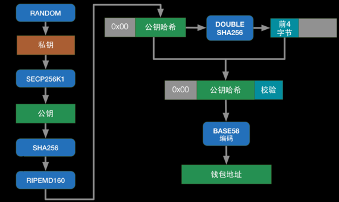

# btcbase模块

本模块实现基于比特币规则的公钥和地址的生成

## 涉及币种
- BTC -- 版本号为0x00
- BCH -- 版本号为0x00
- LTC -- 版本号为0x30
- ZEC -- 版本号为两个字节0x1c,0xb8
- USDT -- 版本号为0x00，与比特币相同
- BTY -- 版本号为0x00, 与比特币相同

## 依赖清单
- github.com/mr-tron/base58/base58
- github.com/haltingstate/secp256k1-go
- golang.org/x/crypto/ripemd160

## 输入输出格式说明
```golang
//传入32字节私钥，生成压缩形式的公钥
func (t BtcBaseTransformer) PrivKeyToPub(priv []byte) (pub []byte, err error)
```
```golang
//传入压缩或非压缩形式的公钥，生成base58编码的地址（压缩和非压缩形式的公钥生成的地址是不同的，但都是合法的）
func (t BtcBaseTransformer) PubKeyToAddress(pub []byte) (addr string, err error)
```

## 生成规则



不同币种的区别只在于版本号

详细介绍可以参考《精通比特币》的第四章：
http://book.8btc.com/books/6/masterbitcoin2cn/_book/ch04.html
