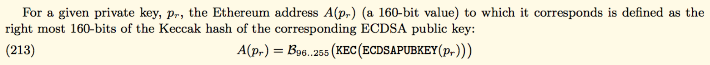

# ethbase

本模块实现基于以太坊规则的公钥和地址的生成

## 涉及币种
- ETH
- ETC

## 依赖清单
- github.com/ethereum/go-ethereum/crypto/sha3
- github.com/haltingstate/secp256k1-go

## 输入输出格式说明
```golang
//私钥生成公钥(压缩形式)
func (t EthBaseTransformer) PrivKeyToPub(priv []byte) (pub []byte, err error)
```
```golang
// 公钥生成地址(带校验码)
// 支持压缩和非压缩形式公钥，压缩形式会先转换成非压缩形式再生成地址，所以生成的地址是相同的
func (t EthBaseTransformer) PubKeyToAddress(pub []byte) (addr string, err error)
```

## 生成规则

白皮书中关于地址生成的介绍：



规则如下：

1. 私钥通过secp256k1生成公钥
2. 公钥经过Kecca256哈希后，取后20字节作为地址
3. 最后输出的地址其实还加了checksum, 将原始地址进行Kecca256哈希，然后把原始地址中某些位的小写字母换成大写，以此添加checksum

checksum举例说明：
```
原始地址：
815a69c8a7b462b65eb772cff5ca91440835e225
经过Kecca256哈希后得到：   a134129fb45c44b66eec1977a57b806475d0778e849574fb363c50353844c422
哈希值中每一个大于7的位，其对应的原始地址中的那一位的小写字母要变成大写，最后生成的地址是这样的：
815a69C8A7b462B65EB772cfF5cA91440835e225
```

go-ethereum中的代码实现如下：
```golang
func (a Address) Hex() string {
	unchecksummed := hex.EncodeToString(a[:])
	sha := sha3.NewKeccak256()
	sha.Write([]byte(unchecksummed))
	hash := sha.Sum(nil)

	result := []byte(unchecksummed)
	for i := 0; i < len(result); i++ {
		hashByte := hash[i/2]
		if i%2 == 0 {
			hashByte = hashByte >> 4
		} else {
			hashByte &= 0xf
		}
		if result[i] > '9' && hashByte > 7 {
			result[i] -= 32
		}
	}
	return "0x" + string(result)
}
```
